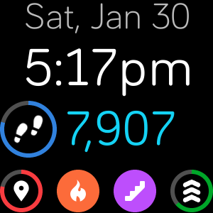

# Readable Clock

**A FitBit clock for the near-sighted**

There are some beautiful FitBit clock faces out there, but I often find that the fonts chosen are too small for me to comfortably read. So I made this clock face with the goal of maximizing the font sizes for readability.

(Made specifically for the Versa 2.)

## Credits

Activity icons provided by Fitbit [SDK Design Assets](https://github.com/Fitbit/sdk-design-assets)
