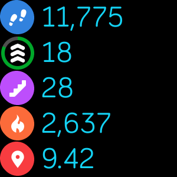

# Readable Clock

**A Fitbit clock face with readable fonts**

There are some beautiful Fitbit clock faces out there, but I often find that the fonts chosen are too small for me to comfortably read. So I made this clock face with the goal of maximizing the font sizes for readability.

Tap anywhere on the screen to see the progress of all your goals:  

Install it on the [Fitbit Gallery](https://gallery.fitbit.com/details/72882fa2-6aba-4a59-aee7-993dcb7e616d).

## Features

* It uses big fonts!
* The rings fill in as each goal is met.
* Tap the screen to show values of all activities.
* Respects 12 or 24-hour clock display setting.
* Respects metric or US distance setting.
* Compatible with the Versa, Versa 2, and Versa Lite.

## Updates

- **13-May-2021**
    - Instead of cycling through each activity one at a time, tapping the screen now toggles to a screen showing the progress of all activities

- **30-Jan-2021**
    - Distance displays as km or mi depending on your settings.
    - Cycle through activity progress by tapping anywhere on the screen.

## Credits

Activity icons provided by Fitbit in the [SDK Design Assets](https://github.com/Fitbit/sdk-design-assets) repository.
